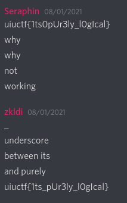

# gatekeeping (Misc 417)
> ᴬᴺᴰ oh frick ˣᴼᴿ ᴺᴼᵀ ᴼᴿ ᴬᴺᴰ ᴬᴺᴰ ᴼᴿ ᴺᴬᴺᴰ ᴺᴼᴿ frick sorry guys ˣᴺᴼᴿ ˣᴺᴼᴿ ᴺᴼᴿ ᴬᴺᴰ ᴬᴺᴰ ᴺᴼᴿ sorry im dropping ˣᴼᴿ my gates all over the ᴼᴿ place ᴺᴼᵀ ᴼᴿ ᴺᴼᵀ sorry
>
> author: Vanilla
>
> handout: https://uiuc.tf/files/d66330b6cb9f5f8f800bcfe622178ab5/synth.v

## Introduction

This challenge is a hardware flag checker in Verilog. I'm pretty underqualified to make this writeup but I can't find anyone else who used this approach on Verilog in a CTF context before, so I hope this is useful as a guide for future challenges - and if someone who knows more is able to make corrections, please do.

I solved this challenge 5 minutes before the CTF ended and it actually mattered for our ranking so I figured I should do a writeup if only for that 🙃

## First look

If we at the provided source, a module `logick` is defined that seems to take inputs `CLK`, `RESET_N`, `BYTE`, and output "GOOD". CLK and RESET are normal hardware pins so we can assume BYTE is out actual input. A bunch of `wire`s, which appear to be some kind of local variables, are defined. A set of `register`s called state are also defined - which seem close enough to be variables too.

Looking at all the bitwise operations, my first thought was to just translate the statements into python equivalents and let z3 do the work. I also (completely wrongly) assumed that BYTE was the flag input of 8 characters, ending up with a script like this:

```python
from z3 import *

BYTE = [BitVec('BYTE%d' % i, 8) for i in range(8)]
o = [BitVec('o%d' % i, 8) for i in range(207)]
s = Solver()
RESET_N = BitVec('RESET_N', 8)

s.add(o[171] == ~BYTE[0])
# ...
s.add(o[155] != 0)

s.check()
print(s.model())
```

This did not work at all, and I figured I would actually have to simulate the hardware anyway to solve this. Although I didn't know what and wasn't possible with Verilog, I decided to try to find some way to use symbolic analysis to solve for an input.

After quite a bit of Googling, it turns out the right keywords in the hardware world are "verification" and "model checking". The applicable tools are mainly designed to prove that hardware can and can't enter failure states, but we can adopt them for our purposes. I went with trying [CoreIR Symbolic Analyser (CoSA)](https://github.com/cristian-mattarei/CoSA) because it looked "reasonable" to use.

## Getting a bit familiar with CoSA

The first thing we need to do is install CoSA. As mentioned on its README, we can just install it from pip. The README also mentions we need to install a tool called [Yosys](https://github.com/YosysHQ/yosys) for Verilog support.

### Installing Yosys

Note that this challenge requires a version of Yosys from Git. I found out after the CTF that **there is a bug somewhere in the 9.0 release that will not translate the Verilog correctly**.

CoSA itself also requires a recent enough build of Yosys. We can start from a docker image like I did during the CTF (`hdlc/yosys`) or build Yosys ourself, although it takes quite a while:

```sh
git clone https://github.com/aman-goel/yosys.git
cd yosys
autoconf
./configure
make
# sudo make install
```

### Using CoSA

The CoSA user manual is a somewhat inpenetrable mass of formal logic and mostly unintelligable to me. Luckily, the examples and documentation section on "Problem Files" give us enough to work with.

Problem files contain a few sections, but all the options just map to command line arguments. Running `CoSA -h` provides pretty helpful descriptions.

At minimum, we need to define the input file and state we want to reach. The documentation details the exact syntax in section 5.3 and [here](https://pysmt.readthedocs.io/en/latest/_modules/pysmt/parsing.html).

Once we have a problem file we can run `CoSA --problem problem.txt` to see its output.

## Solving the challenge

After defining a minimal problem, here's what I had:

```
[GENERAL]
model_files: synth.v[logick]

[DEFAULT]
solver_name: z3

[z]
description: "solve"
assumptions: (GOOD = 1_1);
verification: simulation
expected: True
```

I set the solver to z3 since ~~it's the best~~ I didn't have other engines installed.

If we run this, we'll see an output like the following:
```
> CoSA --problem problem.txt
Parsing file "synth.v"... DONE
Solving "z"  TRUE

*** SUMMARY ***

** Problem z **
Description: "solve"
Result: TRUE
Expected: TRUE
Execution:
---> INIT <---
  I: BYTE = 73_8
  I: CLK = 1_1
  I: GOOD = 1_1
  I: RESET_N = 1_1

---> STATE 1 <---
  S1: BYTE = 99_8

---> STATE 2 <---
  S2: BYTE = 97_8

---> STATE 3 <---
  S3: BYTE = 108_8

---> STATE 4 <---
  S4: BYTE = 125_8
  S4: CLK = 0_1

---> STATE 5 <---
  S5: BYTE = 0_8
  S5: CLK = 1_1
  S5: RESET_N = 0_1
```

At this point I realized the input was one byte per "state", so my z3 script using an 8 byte input was hopeless anyway.

It looks like we are getting somewhere - the `BYTE` inputs are valid ASCII, `Ical}`, and it looks like the end of the flag. However, the simulation ends after 5 steps. 

We can use the `bmc_length` option to make it simulate longer.
```
[DEFAULT]
bmc_length: 6
solver_name: z3

```

Doing this outputs one more byte of the flag, so we can just increase until we've simulated "enough".

At 26 characters, we recover a slightly corrupted version of the flag: `}iuctf{1ts0pUr3ly_l0gIcal}`. Unfortunately, just replacing the `}` with a `u` doesn't produce the correct flag even though it looks close.

If we paid attention while increasing the simulation length, the model checker is able to find a few variations on the input, one of which has the inner part being `{1ts_pUl3ly_l0gIcal}`. From this we can figure out the actual flag, `uiuctf{1ts_pUr3ly_l0gIcal}`.

I did not pay attention, but fortunately one of my teammates is a guess god.



## Creating symbolic constraints ourselves

If we inspect the created constraints by CoSA (using the `--smt2-log` flag) we can see the approach used is actually relatively simple.

A new variable is created for each register/wire at time position and the constraints are connected over time. We could actually do something similar ourselves, which would allow for easier modification of the constraints. That way we could easily lock the first characters to "uiuctf", for example.

I didn't try this for this challenge, but the steps to translate the constraints would likely be:
- Parse all the statements in the Verilog
- Copy each statement at each time
- Map wires to their times - for example; `assign _183_ = _182_ | _172_;` becomes `assign AT_TIME_1_183_ = AT_TIME_0_182_ | AT_TIME_0_172_;`
- Add intial and final constraints, like GOOD being 1 at the end and CLK toggling at the end
- Throw into SAT checker of choice

### Code

```sh
> cat problem.txt
[GENERAL]
model_files: synth.v[logick]

[DEFAULT]
bmc_length: 26
solver_name: z3

[z]
description: "solve"
assumptions: (GOOD = 1_1);
verification: simulation
expected: True

> CoSA --problem problem.txt
```

`uiuctf{1ts_pUr3ly_l0gIcal}`
